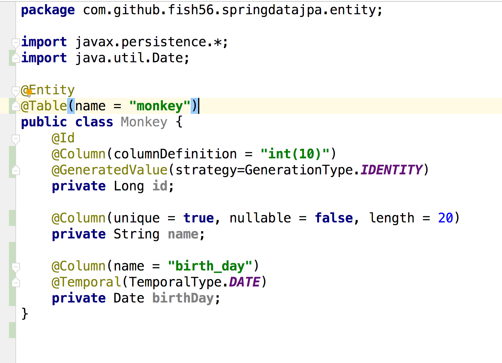
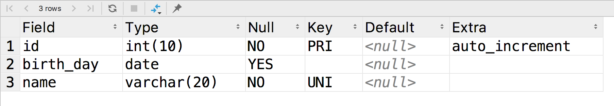

## 创建表

学习Spring Data JPA，首先要能够正确的通过实体对象在创建数据库中创建相应的表。


假设我们希望创建下面的表，我们该如何做？

```sql
create table monkey(
  id int(10) primary key auto_increment,
  name varchar(20) not null unique ,
  birthday DATETIME
);
```

上面的是非常常见的SQL语句，我们创建出了一个monkey表。

那么，这种情况我们如何写我们的Entity，如何通过JPA来创建我们的表？

先说结论吧，我们可以这样：



- `@Table(name = "monkey")` `@Column(name = "birth_day")`

  有的时候我们希望自定义表和列的名称，比如Java中一个是驼峰式的命名风格，而SQL中则一般使用

  下划线风格。所以我们可以通过上面两个注解来做出映射，通过name属性来明确生成的表的名称。

  不过Spring Data JPA会自动的把驼峰风格转化为下划线风格，所以上面两个写法其实可以省略，我写出来主要是告诉大家可以这样做

- `@Column(columnDefinition = "int(10)")`

  我们知道Java中的数据类型和SQL中并不是一一对应的，所以如果我们希望精确的设置数据库中字段的类型，我们可以通过这个注解来做

- `@GeneratedValue(strategy=GenerationType.IDENTITY)`

  这个注解对应数据库的`auto_increment`类型

- `@Column(unique = true, nullable = false, length = 20)`

  对应数据库中的not null, unique。



这就是最常用的写法。


### 总结下

我们给一个类注解为`@Entity`后，Spring Data JPA就会采取合适的策略为我么建立合适的表结构。

