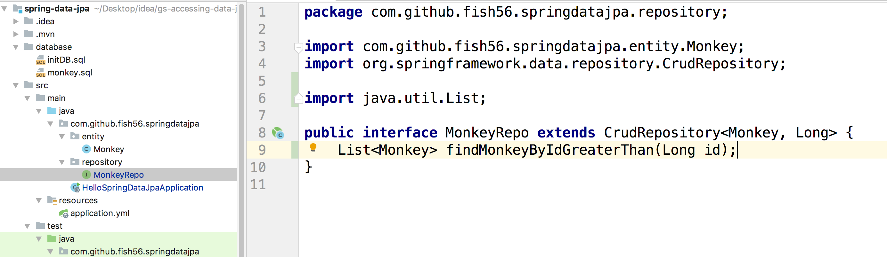
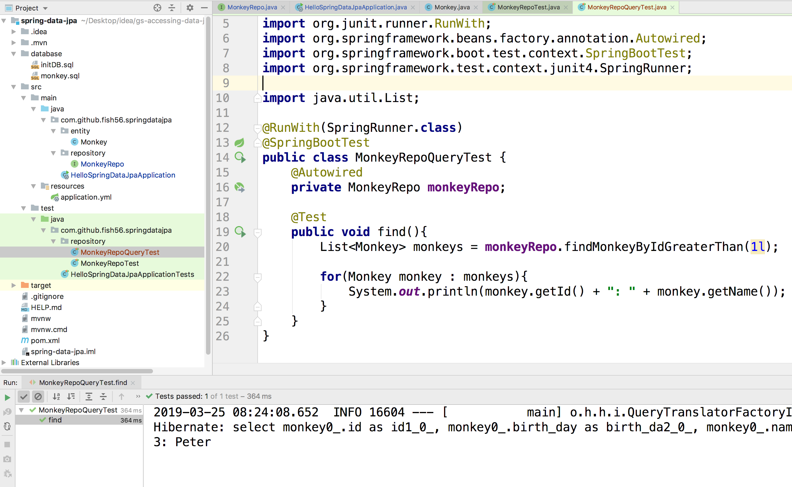

## 自定义查询

不过只看到前面的话，你可能会觉得奇怪，这个有什么啊，不就是简写了普通的增删改查吗，，是的，如果只看之前的，确实没什么奇怪的。

但是接下来就是JPA的亮点。

比如传统上你要是想查询： ID  > 2 的字段，你会怎么写？

- 创建数据库连接池
- 创建Session
- 执行类似于 select id,name from hello_spring_data_jpa where id > 2;
- 异常处理以及防止SQL注入
- 关了连接

也行你使用了一些框架让代码更简洁。

但是我们来看一下在SPring data JPA中是如何做的

- 声明接口方法
- 直接使用

这一步我们只需要在原来的MonkeyRepo这个接口中额外补充一个方法就行。注意：方法的名字必须按照我这么写。



``` java
@RunWith(SpringRunner.class)
@SpringBootTest
public class MonkeyRepoQueryTest {
    @Autowired
    private MonkeyRepo monkeyRepo;

    @Test
    public void find(){
        List<Monkey> monkeys = monkeyRepo.findMonkeyByIdGreaterThan(1l);

        for(Monkey monkey : monkeys){
            System.out.println(monkey.getId() + ": " + monkey.getName());
        }
    }
}
```


创建一个测试用例，直接来使用它就行了，和之前的用法是一样的。然后我直接运行了测试用例。因为我的数据库还是继承之前的状态，所以总共只有两条数据，只有一条数据的id大于2，如果你之前在自己的电脑上多存储了几次数据，那你看到的会比我多。


### 分析

这就是JPA强大的地方，它能够根据方法名字自动的为我们生成对应的SQL实现。

这个怎么说呢，用自然语言描述这种规则很难。我们直接看一些例子吧。


**开发者只需要实现接口就行了**，大大的简化了开发流程。。。


- 创建一个直接或者间接的继承自`Repository`的接口

  Spring Data JPA就会在运行时搜索所有继承自Repository接口的接口

- 按照特定的规则，声明方法，JPA自动根据接口名来实现具体的方法。

### Git

``` bash

```