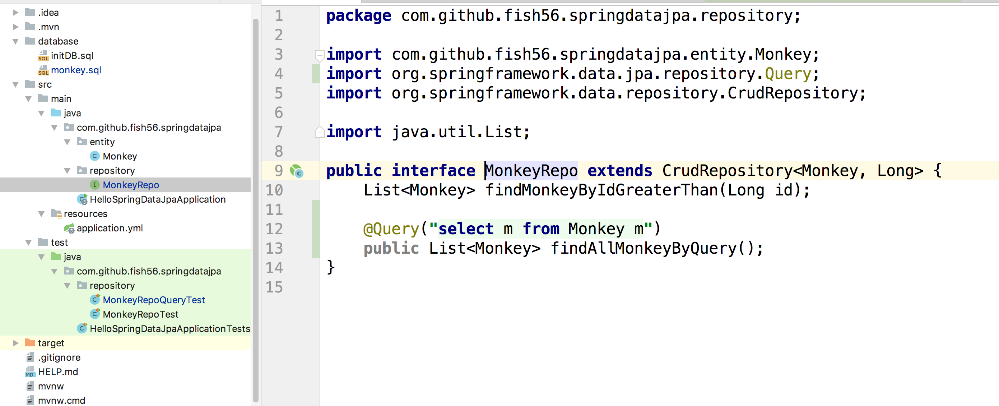
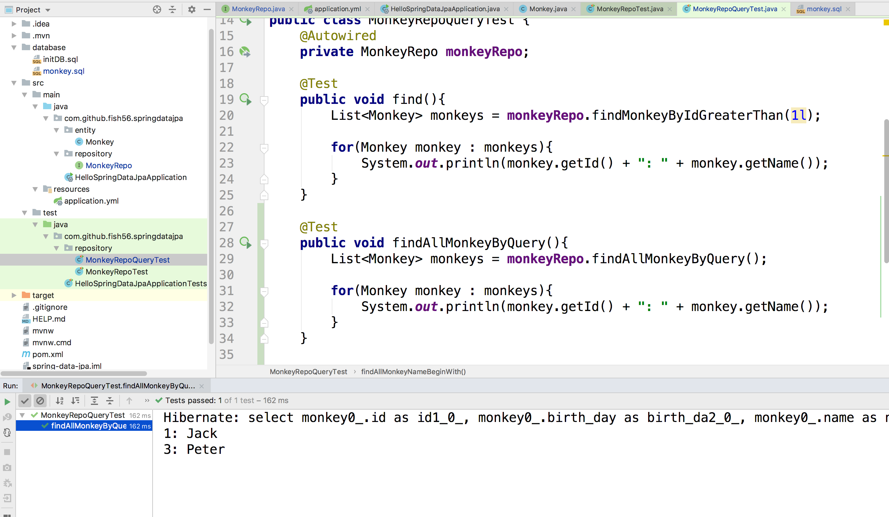
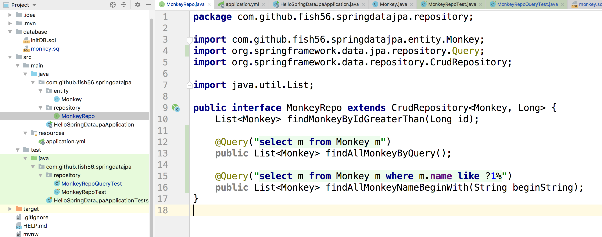
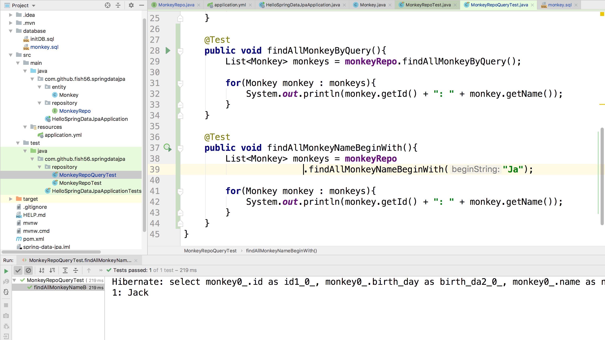
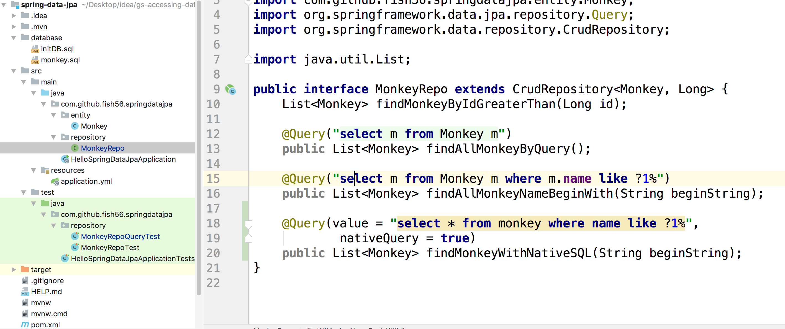
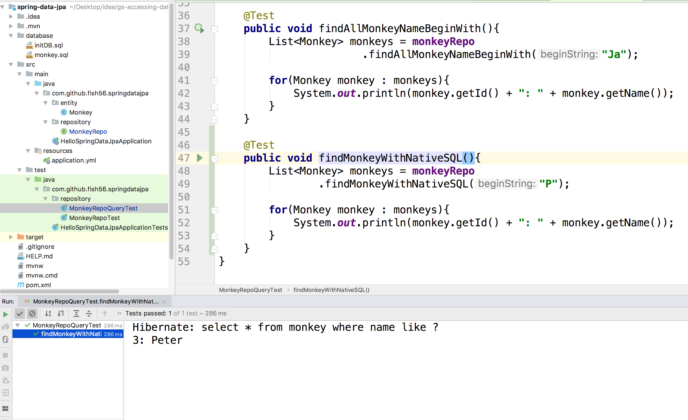

## 自定义查询

有些情况下我们可能想自定义SQL语句，我们就可以使用下面的写法。




```java
public interface MonkeyRepo extends CrudRepository<Monkey, Long> {
    List<Monkey> findMonkeyByIdGreaterThan(Long id);

    @Query("select m from Monkey m")
    public List<Monkey> findAllMonkeyByQuery();
}
```

这里我们想要查询ID大于指定数值的记录。然后我们通过@Query这个注解来标注我们的方法，Spring Data JPA就会自动的把它们翻译成对应的SQL语句。 写法和一般的SQL基本类似，但是写表名的时候，我们给表指定实体类型，这样JPA 才能做出正确的解析。

然后我们创建一个测试用例，来执行它。




```java
    @Test
    public void findAllMonkeyByQuery(){
        List<Monkey> monkeys = monkeyRepo.findAllMonkeyByQuery();

        for(Monkey monkey : monkeys){
            System.out.println(monkey.getId() + ": " + monkey.getName());
        }
    }
```


好了，接下啦，再来强大一点的，我们来传递参数。这里我们所有name字段以beginString开头的记录。





```java
    @Test
    public void findAllMonkeyNameBeginWith(){
        List<Monkey> monkeys = monkeyRepo
                       .findAllMonkeyNameBeginWith("Ja");

        for(Monkey monkey : monkeys){
            System.out.println(monkey.getId() + ": " + monkey.getName());
        }
    }
```

果然查询到了结果。


## Native SQL

有的时候你可能想用存粹的原生的SQL，那么可以这样做

给注解声明一个nativeQuery属性，并设置为true。



```java
@Query(value = "select * from monkey where name like ?1%", nativeQuery = true)
 public List<Monkey> findMonkeyWithNativeSQL(String beginString);
```




```java
    @Test
    public void findMonkeyWithNativeSQL(){
        List<Monkey> monkeys = monkeyRepo
                .findMonkeyWithNativeSQL("P");

        for(Monkey monkey : monkeys){
            System.out.println(monkey.getId() + ": " + monkey.getName());
        }
    }
```

不错吧

## Git

```bash
$ git show native_query
```

