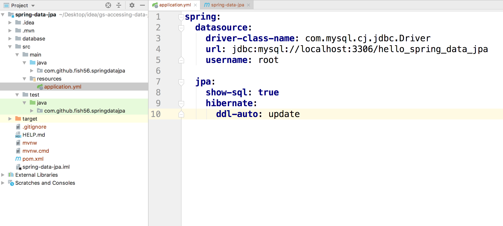
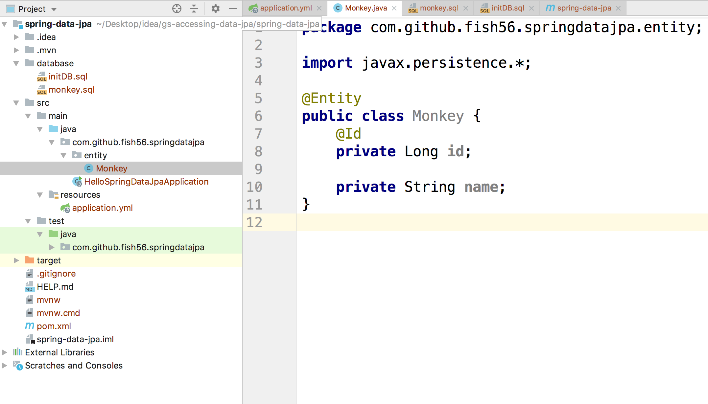
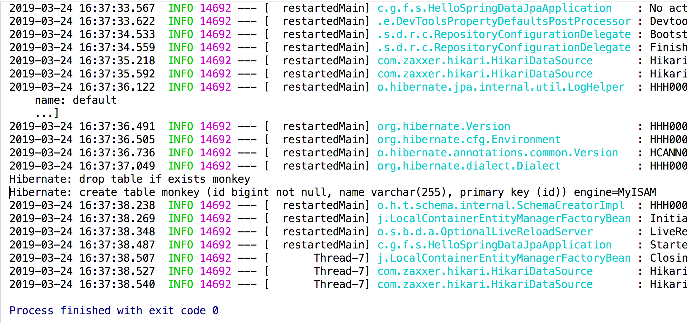
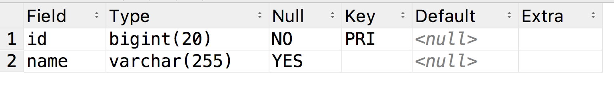

## 本节内容

1. 基本的Springboot项目
2. 相关依赖
3. 配置文件
4. 简单代码

#### 初始化

首先初始化一个Spring Boot项目。具体细节说了很多次了，这里我就不多说了。主要是和大家确认下pom文件有下面的依赖：

``` xml
   <dependencies>
        <dependency>
            <groupId>org.springframework.boot</groupId>
            <artifactId>spring-boot-starter-data-jpa</artifactId>
        </dependency>

        <dependency>
            <groupId>org.springframework.boot</groupId>
            <artifactId>spring-boot-devtools</artifactId>
            <scope>runtime</scope>
        </dependency>
        <dependency>
            <groupId>mysql</groupId>
            <artifactId>mysql-connector-java</artifactId>
            <scope>runtime</scope>
        </dependency>
        <dependency>
            <groupId>org.springframework.boot</groupId>
            <artifactId>spring-boot-starter-test</artifactId>
            <scope>test</scope>
        </dependency>
    </dependencies>
```

- `spring-boot-starter-data-jpa`：核心依赖，添加到pom文件后Spring Boot会自动解析
- `spring-boot-devtools`：这个我在基础教程里说过，可以让我们的项目重启的更快
- 然后是MySQL驱动，当然你可以使用其他数据库。
- 注意不要引入`spring-boot-starter-web`这个模块， 我们这里用不到它，你要是添加了它的话会让我们的程序启动的很慢，浪费时间

**然后请读者自行准备好数据库的开发环境。**

#### 配置文件

```yml
spring:
  datasource:
    driver-class-name: com.mysql.cj.jdbc.Driver
    url: jdbc:mysql://localhost:3306/hello_spring_data_jpa
    username: root

  jpa:
    show-sql: true
    hibernate:
      ddl-auto: update
```



然后我们在`application.yml`中添加上面的配置信息

前五行是数据库的连接信息，这里我本地的mysql端口号为3306，同时我的用户名是root，密码为空，而且我手动**创建了`hello_spring_data_jpa`这个数据库**。读者请注意和自己的开发环境保持一致。


`spring.jpa.show-sql`设置为true可以在调试的时候打印出框架执行的sql语句，对我们学习来说很有用。

`spring.jpa.hibernate.ddl-auto`这个字段等会再说，大家先这样写。

Spring data JPA 底层是使用hibernate来驱动的

#### 第一个程序

创建下面的包和类：

```java
package com.github.fish56.springdatajpa.entity;

import javax.persistence.*;

@Entity
public class Monkey {
    @Id
    private Long id;

    private String name;
}
```



然后可以启动程序了。注意，因为我们没有引入`spring-boot-starter-web`，所以程序启动后立刻退出



从log中看到，Spring Boot热情的帮我们在数据库中创建了对应的表。


请读者连接自己本地的数据库：

```sql
use hello_spring_data_jpa;
desc monkey;
```



## Git

``` bash
$ git show init
```

这个初始化的版本，如果读者遇到了环境配置的问题，可以直接clone我的代码，或者提issue。