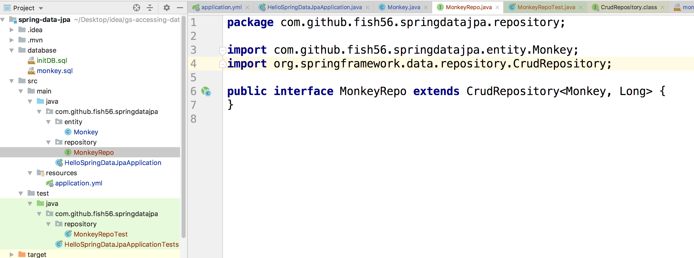
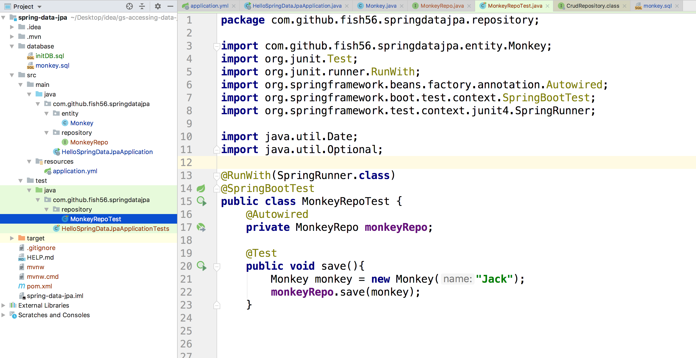
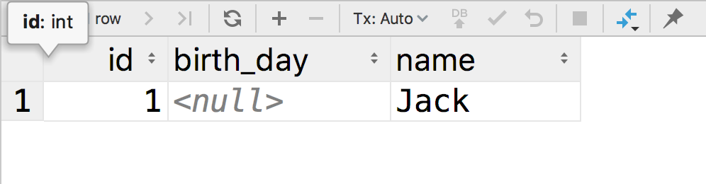
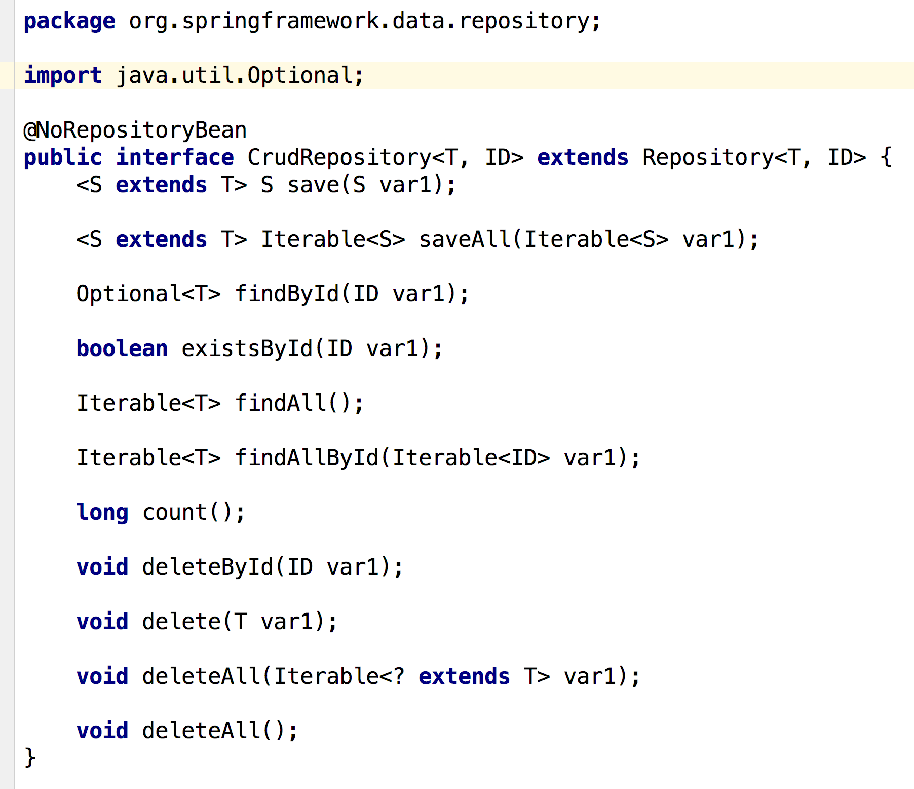
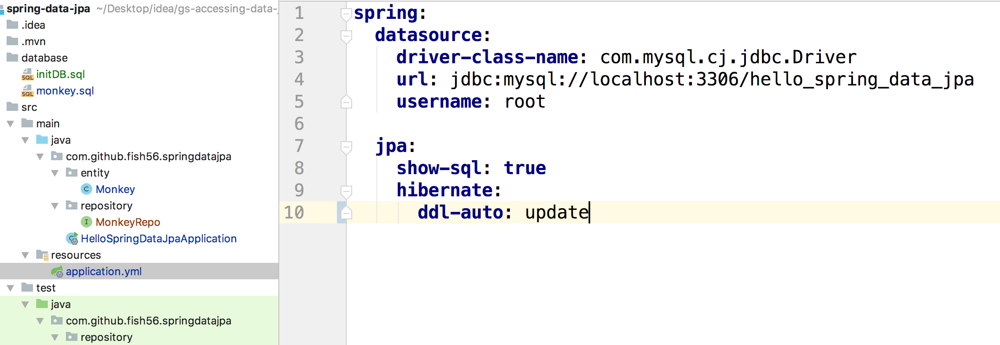
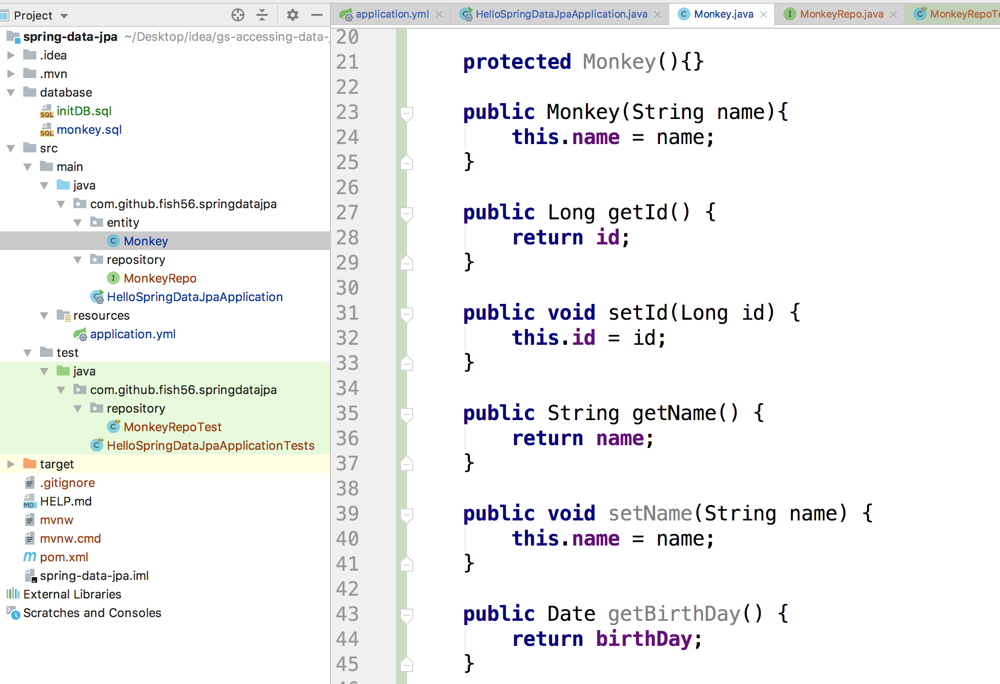

## 查询

好了，接下来是重点，我们如何查询数据库呢？

优雅的查询数据是JPA的核心内容，我们想在Spring Boot中使用JPA查询数据只要做到：

- 创建一个继承自Repository 的接口
- 通过`@Autowired`自动注入

我们先看代码，再解释。

首先申明一个接口：




然后在创建测试文件，添加下面的代码：



```java
@RunWith(SpringRunner.class)
@SpringBootTest
public class MonkeyRepoTest {
    @Autowired
    private MonkeyRepo monkeyRepo;

    @Test
    public void save(){
        Monkey monkey = new Monkey("Jack");
        monkeyRepo.save(monkey);
    }
}
```


你没有看错，我们只写了几行代码。然后大家运行下测试用例，应该就能在数据库中看到结果了：



### 分析

```java
public interface MonkeyRepo extends CrudRepository<Monkey, Long> {
}
```

我们首先申明了一个接口，这个接口继承自`CrudRepository<Monkey, Long>`。而`CrudRepository<Monkey, Long>`这个接口是JPA中定义的。

下面是这个接口的源代码



我们可以看到这个接口也就是声明了一些增删改查（CRUD）的方法。

可能有同学会问了，实现方法呢? 为什么只有接口声明没有具体实现呢？ 其实上面的几种方法都是属于基本的操作，没什么技术含量的。Spring Data JPA在运行时可以自动的帮我们生成相应的SQL语句，做出相应的处理。


我们如果想使用的话，只需要使用`@Autowired`来注解我们的属性，Spring Data JPA 就能自动的帮我注入相应的实例，这个实例会自动实现`CrudRepository<Monkey, Long>`这个接口的所有方法。


这个接口中共有11个方法，也算是我们在使用SQL数据库中做常用的11中操作了。接下来我们来操作一下


在操作之前请做这两件事

- 因为这个我们要想数据库中存入数据，所以记得把application.yml 中的`spring.jpa.hibernate.ddl-auto`的值修改为`update`



- 给Monkey类添加setter 和 getter方法



同时给他设置构造函数。不过这里注意

- `Monkey(String name)`这个构造函数是给我们自己等会用的
- `Monkey()`这个无参构造函数是给hibernate用的，hibernate运行时要求实体类有一个无参构造函数

```java
    protected Monkey(){}

    public Monkey(String name){
        this.name = name;
    }

    public Long getId() {
        return id;
    }

    public void setId(Long id) {
        this.id = id;
    }

    public String getName() {
        return name;
    }

    public void setName(String name) {
        this.name = name;
    }

    public Date getBirthDay() {
        return birthDay;
    }

    public void setBirthDay(Date birthDay) {
        this.birthDay = birthDay;
    }
```

