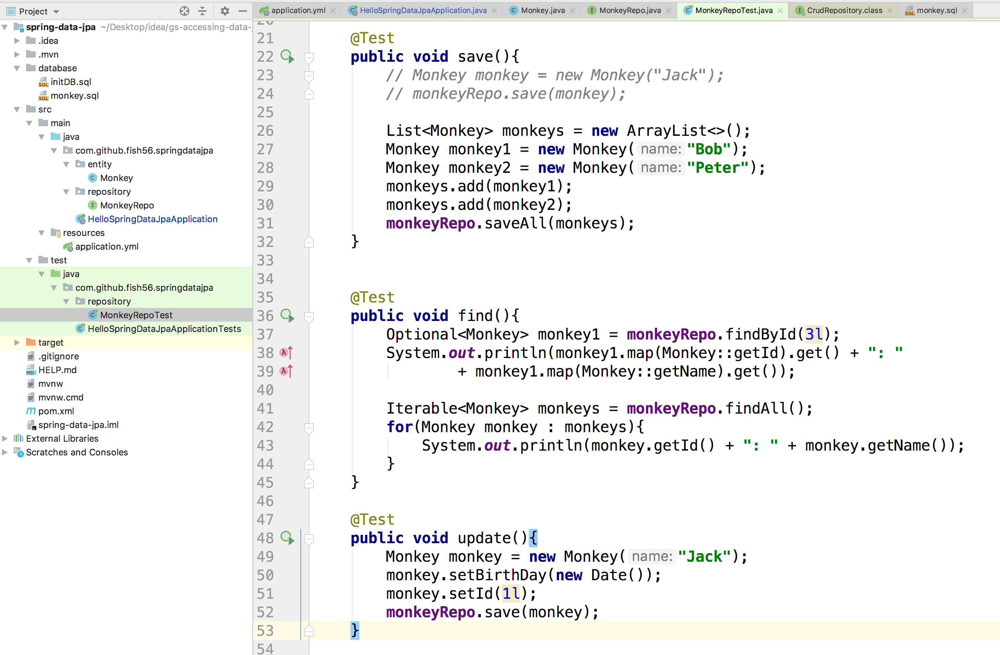
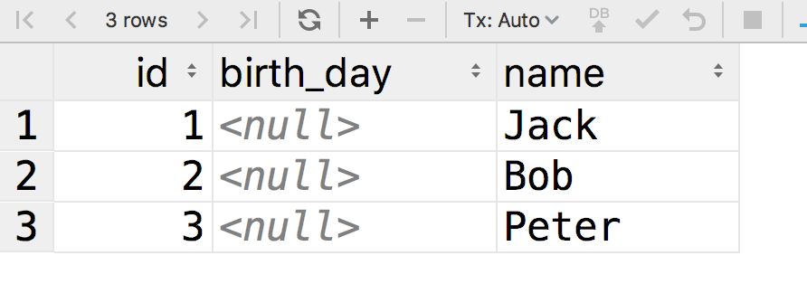
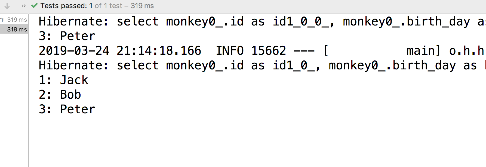
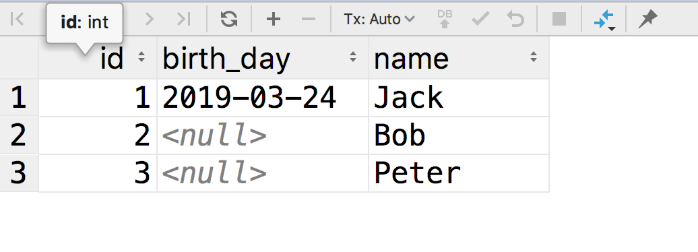
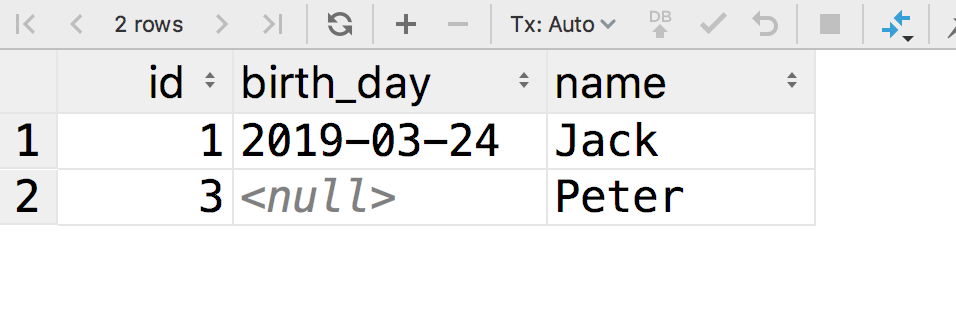

## Query



```java
@RunWith(SpringRunner.class)
@SpringBootTest
public class MonkeyRepoTest {
    @Autowired
    private MonkeyRepo monkeyRepo;

    @Test
    public void save(){
        // Monkey monkey = new Monkey("Jack");
        // monkeyRepo.save(monkey);

        List<Monkey> monkeys = new ArrayList<>();
        Monkey monkey1 = new Monkey("Bob");
        Monkey monkey2 = new Monkey("Peter");
        monkeys.add(monkey1);
        monkeys.add(monkey2);
        monkeyRepo.saveAll(monkeys);
    }


    @Test
    public void find(){
        Optional<Monkey> monkey1 = monkeyRepo.findById(3l);
        System.out.println(monkey1.map(Monkey::getId).get() + ": " 
                + monkey1.map(Monkey::getName).get());

        Iterable<Monkey> monkeys = monkeyRepo.findAll();
        for(Monkey monkey : monkeys){
            System.out.println(monkey.getId() + ": " + monkey.getName());
        }
    }

    @Test
    public void update(){
        Monkey monkey = new Monkey("Jack");
        monkey.setBirthDay(new Date());
        monkey.setId(1l);
        monkeyRepo.save(monkey);
    }

    @Test
    public void delete(){
        monkeyRepo.deleteById(2l);
    }
}
```

我直接把所有的代码都贴上来了。大家可以一个个尝试

我们来看代码，其实很简单，就是对应的结构

#### 插入数据

我们想ca



#### 查询数据



#### 更新



#### 删除



## Git

```bash
$ git show Crud
```

